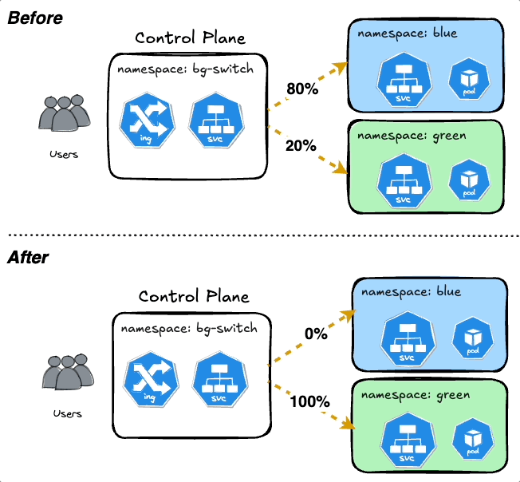

# Canary Deployments using Kubernetes Namespaces and Ingress Nginx



# Quickstart
1. Create Namespaces
```
kubectl create ns nginx-blue
kubectl create ns nginx-green
kubectl create ns canary-bg-switch
```
2. Setup your `/etc/hosts` to point to the custom URL within `blue-ingress.yaml` and `green-ingress.yaml`
3. Install the manifests
```bash
kubectl apply -f blue-ingress.yaml -n canary-bg-switch
kubectl apply -f green-ingress.yaml -n canary-bg-switch
kubectl apply -f blue-service.yaml -n canary-bg-switch
kubectl apply -f green-service.yaml -n canary-bg-switch
kubectl apply -f blue-app.yaml -n nginx-blue
kubectl apply -f green-app.yaml -n nginx-green
```
4. Split the traffic to send 20% of the traffic to the *blue-ingress.yaml*
```bash
kubectl patch ingress canary-blue-ingress -n canary-bg-switch --type=json -p '[{"op": "replace", "path": "/metadata/annotations/nginx.ingress.kubernetes.io~1canary-weight", "value": "20"}]'
```
5. Run the `monitor.sh` script to verify traffic split
```bash
Blue: 9 (20%), Green: 36 (80%), Total: 45
```